# Stock Orbit

> 바탕화면에 상시 띄워두는 실시간 주식 관심종목 데스크톱 위젯

사람과 [Claude](https://claude.ai)가 함께 만든 결과물입니다.

"AI에게 상세한 요구사항을 주면 프로덕션 수준의 React 프로젝트가 나오는가?"를 검증하기 위한 실험이었고, 결론부터 말하면 **_나오지 않았습니다._**
하지만 **사람이 설계를 잡고 AI가 구현을 담당하는 구조**에서는 가능했습니다.

### 이 프로젝트에서 확인한 것

> AI가 코드를 대신 써주는 시대가 됐지만, 개발자가 설계·보안·성능에 대한 배경지식을 갖추고 정확하게 요청할수록 고품질의 결과물로 돌아옵니다.
> 반대로 배경지식 없이 요구사항만 단순하게 전달하면, 동작은 할지언정 코드 품질은 보장할 수 없고, 결국 코드 리뷰와 유지보수에서 어려움을 겪게 됩니다.

| 리스트 | 그리드 | 타일 (히트맵) |
|:---:|:---:|:---:|
| 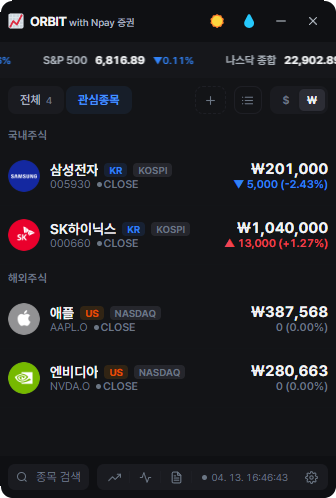 | 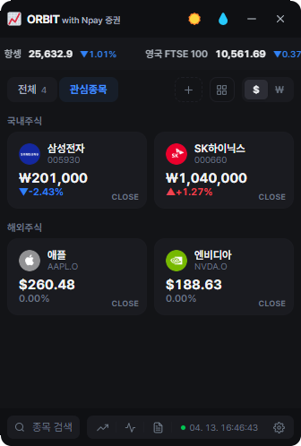 | 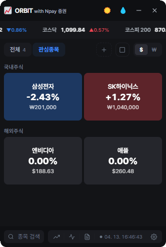 |

**[다운로드](https://github.com/ppsszero/stock-orbit/releases)** ·
**[만들면서 부딪힌 것들](#만들면서-부딪힌-것들)**

---

## 목차

- [TL;DR](#tldr)
- [주요 기능](#주요-기능)
- [만들면서 부딪힌 것들](#만들면서-부딪힌-것들)
- [역할 분담](#역할-분담)
- [기술 스택 & 아키텍처](#기술-스택--아키텍처)
- [설치 & 실행](#설치--실행)
- [참고 문서](#참고-문서)

---

## TL;DR

| # | 문제 | 결과 |
|---|---|---|
| 1 | AI 코드의 60%가 리팩토링·중복제거에 소모됨 | 설계 원칙 선행으로 리팩토링 3→1회 |
| 2 | AI가 "완료"라 했지만 코드 중복 6곳 + 보안·안정성 이슈 숨어있음 | 시니어 리뷰 워크플로우 도입 → 릴리즈 전 7건 전수 발견·수정 |
| 3 | CSS transform 시각 보정이 인접 요소 클릭을 차단 | hit-test 격리 패턴으로 시각 보정 + 클릭 정상화 |
| 4 | 비공식 API 100종목 폴링 시 시간당 28만 요청 → 차단 위험 | 6중 안전장치로 시간당 3,600으로 80배 감소 |
| 5 | Emotion 테마 전환 시 전체 스타일 재생성 | CSS 변수 방식으로 **리렌더 0건** 달성 |
| 6 | AI가 API 응답의 3개 세션 중 2개만 구현하고 "완료" 판단 | 사람이 누락 발견 → **설계 전 필드 매핑 확인** 프로세스 도입 |

---

## 주요 기능

| | 기능 | 설명 |
|---|---|---|
| 📈 | **실시간 시세** | 네이버 증권 API 기반 국내/해외 주식 (KR · US · JP · CN · HK · VN) |
| 🎨 | **3가지 뷰** | 리스트 · 그리드 · 타일 히트맵 (크기=시가총액, 색=등락률) |
| 🔍 | **종목 검색** | 한글/영문/코드 자동완성, 키보드 네비게이션 |
| 📊 | **글로벌 랭킹** | 국가별 거래량/거래대금 상위 종목 |
| 💹 | **투자 동향** | KOSPI/KOSDAQ 매매동향, 프로그램, 경제 캘린더 |
| 📰 | **뉴스** | AI 브리핑, 메인 뉴스, 머니스토리 |
| 🔄 | **자동 업데이트** | 인앱 모달 UI (진행률 바 + "지금 재시작" 버튼) |
| 🛡 | **API 보호** | 30개 종목 한도 + 10개 배치 폴링 + 429 backoff + jitter |

<details>
<summary><b>전체 기능 목록</b></summary>

| 기능 | 설명 |
|---|---|
| 드래그 정렬 | dnd-kit 기반, 그룹 내 이동만 허용 |
| 프리셋 | 관심종목 그룹 관리 (추가/삭제/이름변경) |
| 글로벌 지수·환율 | 상단 마퀴 티커 (GSAP, hover 멈춤) |
| 종목 상세 | 앱 내 모달 + 네이버 증권 웹뷰 |
| 스크린샷 | PNG 라운드 코너, 단축키 캡처 |
| 테마 | 라이트/다크 전환 (리렌더 0건) |
| 위젯 | 투명도 조절, 항상 위 고정, KRW/USD 전환 |
| 공지사항 | Secret Gist 기반 — 앱 재배포 없이 변경 |
| 설정 | 해상도, 새로고침 간격, 글자 크기, 단축키 등 |
| 오프라인 감지 | 네트워크 끊김 배너 + 복귀 시 자동 복구 |

</details>

### 스크린샷

| 라이트 모드 | 종목 검색 | 종목 상세 |
|:---:|:---:|:---:|
| 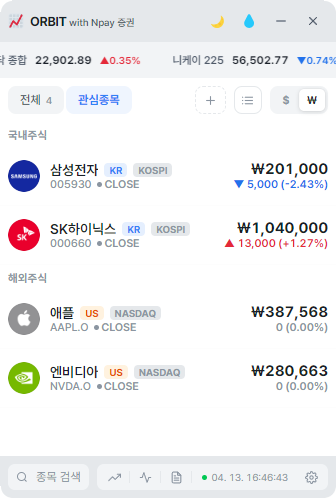 | 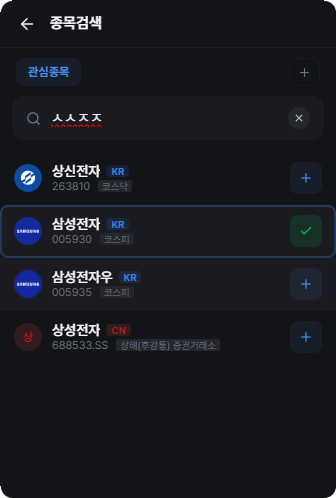 | 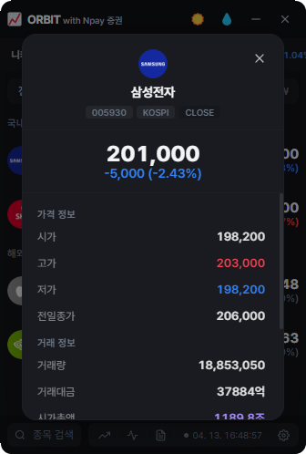 |

| 뉴스 AI 브리핑 | 투자정보 | 랭킹 |
|:---:|:---:|:---:|
| 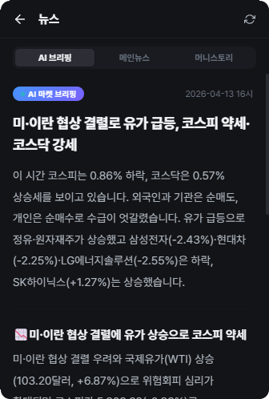 | 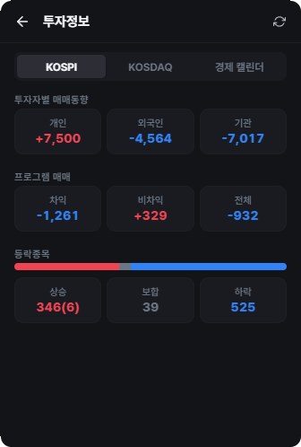 | 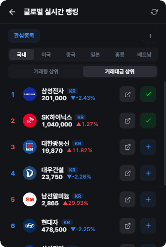 |

| 그룹 추가 | 경제 캘린더 | 웹뷰 |
|:---:|:---:|:---:|
| 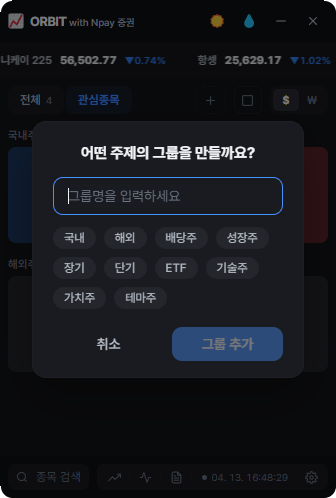 | 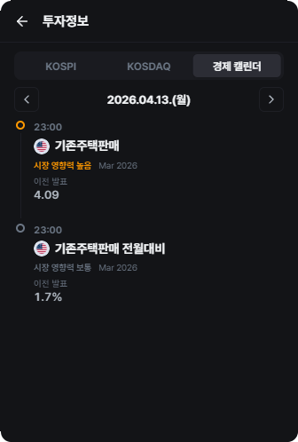 | 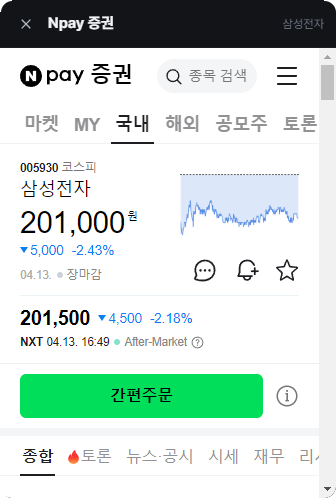 |

| 뉴스 메인 | 머니스토리 | 지표·환율 | 설정 |
|:---:|:---:|:---:|:---:|
| 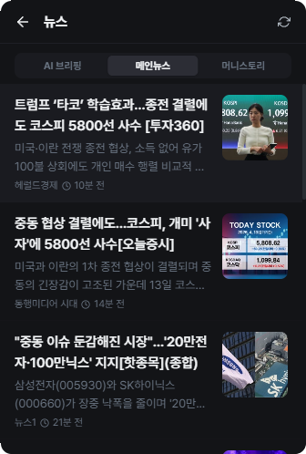 | 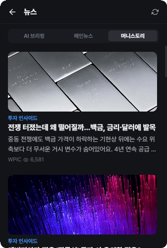 | 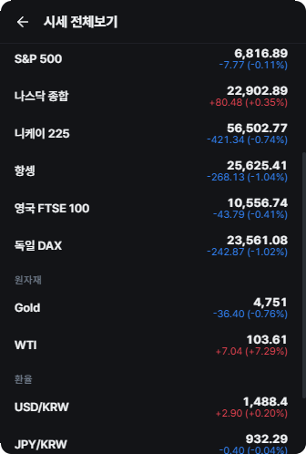 | 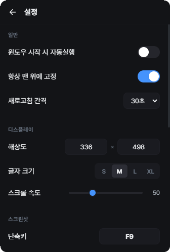 |

---

## 만들면서 부딪힌 것들

> 이 프로젝트의 가치는 완성된 앱이 아니라, **AI와 협업하며 부딪힌 실전 문제와 그 해결 과정**입니다.
> 각 항목은 **Problem → Analyze → Action → Result** 순서로 정리했습니다.

---

### #1 설계 원칙 없이 AI에게 시키면 리팩토링으로 돌아옵니다

**Problem**

- AI에게 상세한 요구사항을 전달했습니다 (ASCII 와이어프레임, API URL, 인터랙션 명세)
- "무엇을 만들 것인가"는 충분했지만, **"어떤 원칙으로 만들 것인가"가 빠져 있었습니다**
- 결과: 기능 구현 30% · 리팩토링 40% · 중복 제거 20% · 버그 수정 10%
- **전체 시간의 60%가 뒷처리에 소모됐습니다**

**Analyze**

- "도메인 기반으로 구조를 바꿔라"고 지시했을 때, AI는 파일을 폴더별로 *이동만* 했습니다
- 파일 **내부**의 책임 분리는 수행하지 않았습니다
- AI는 "폴더를 나눠라"와 "책임을 나눠라"를 **같은 의미로 이해하지 않습니다**
- 구조 원칙을 명시하지 않으면 AI는 자체 기본값으로 처리합니다

**Action** — 코드 작성 **전**에 7개 설계 규칙을 명시적으로 전달했습니다:

- feature 기반 폴더 구조 (`app / features / shared`)
- Smart Parent / Dumb Children 패턴
- hooks / utils / components 3분할
- 하나의 파일에 2개 이상 책임 금지
- `any` 사용 금지
- 동일 로직 2곳 이상 반복 시 추출 의무화
- ViewModel 적용 기준 명확화

**Result**

- 리팩토링 사이클 **3회 → 1회**
- 원칙 정립 후 추가한 스크린샷 기능은 첫 구현에서 올바른 위치에 코드가 배치됐습니다
- 구조 재발 이슈 **0건**

<details>
<summary><b>처음에 전달한 설계 원칙 (17개)</b></summary>

```
[구조 규칙]
- feature 기반 폴더 구조 (app / features / shared)
- 모든 feature는 hooks · utils · components로 분리
- hooks: 데이터, 상태, 비즈니스 로직 (useEffect, fetch, useState)
- utils: 순수 함수 (파싱, 포맷 — DOM 접근 금지)
- components: UI 렌더링만
- 최상위 컴포넌트는 orchestration만 담당
- 하나의 파일에 2개 이상의 책임이 있으면 반드시 분리

[컴포넌트 규칙]
- Smart Parent / Dumb Children
- 리스트 아이템은 부모가 자주 리렌더되고 자기 props가 안 바뀌는 경우에만 memo
- 불필요한 useEffect 금지
- props drilling보다 훅 사용

[타입 규칙]
- any 금지
- API 응답은 역추론 타입 정의
- 등락 방향은 change 부호가 아닌 changeDirection 필드 기반

[중복 규칙]
- 동일 로직 2곳 이상 → 반드시 추출 (유틸 or 컴포넌트 or 훅)
- API 데이터 = UI 데이터인 곳 → ViewModel 불필요
- 변환 로직이 있고 여러 곳에서 반복 → ViewModel 적용
```

</details>

<details>
<summary><b>프로젝트 중에 추가 학습한 원칙 (15개) — 이것들이 없어서 실제 버그가 발생했습니다</b></summary>

```
[스타일 규칙] — 부재 시: hex 하드코딩 난무, transform hit-test 버그
- 하드코딩 색상/간격 금지 — sem.* 시맨틱 토큰만 사용
- CSS 변수 기반 테마 — 컴포넌트에서 theme.ts/vars.ts 직접 import 금지
- 동적 css() 함수 호출은 사전 계산된 정적 맵으로 대체
- transform 시각 보정은 flex:1 컨테이너가 아닌 내부 블록에 적용 (hit-test 침범 방지)

[Electron/IPC 규칙] — 부재 시: null 크래시, 메모리 릭, path traversal, SSRF
- 모든 IPC 핸들러에서 mainWindow null/destroyed 체크 필수
- preload의 이벤트 리스너는 cleanup 함수를 반환할 것
- 전역 리스너는 useEffect cleanup 또는 import.meta.hot.dispose에서 해제
- 사용자 입력 파일 경로는 path.basename()으로 정제 (path traversal 방지)
- 외부 fetch 프록시는 URL allowlist 적용 (SSRF 방지)

[API 규칙] — 부재 시: 종목 30개 초과 시 차단 위험, backoff 리셋 버그
- 비공식 API는 rate-limit 방어를 기본 전제로 설계
- 배치 요청 시 배치 간 지연(sleep) 필수
- 429/403 응답 시 exponential backoff — 단일 성공으로 리셋 금지 (cooldown 필요)
- React Query retry는 자체 backoff와 충돌하므로 비활성화

[테스트 규칙] — 부재 시: 테스트 전체 실패
- 컨텍스트 의존 컴포넌트(useConfirm, useToast) 테스트 시 Provider 래핑 헬퍼 사용
- jsdom에 없는 API(ResizeObserver 등)는 test/setup.ts에 폴리필
```

처음부터 이 32개를 전부 전달했다면 리팩토링 3회, 보안 이슈 3건, 성능 이슈 2건, 테스트 실패를 **사전 방지**할 수 있었습니다.
하지만 이 32개를 "처음부터 전달"하려면, **개발자 본인이 먼저 알고 있어야 합니다.** AI에게 건네는 요청의 품질은 결국 개발자의 배경지식에 비례합니다.

</details>

---

### #2 AI가 "완료"라고 해도 끝이 아닙니다 — 별도 리뷰 단계가 필수입니다

**Problem** — AI에게 "더 이상 개선할 게 없다"고 들었지만, 직접 코드를 읽어보니:

- 동일한 탭 스타일이 **2곳에서 독립 구현**
- `StockLogo`가 이미 있는데 **3곳에서 로고+폴백을 각자 구현**
- 6곳에서 `{dir === 'up' ? '▲' : '▼'}` **같은 삼항 반복**
- UI baseline 어긋남, 컴포넌트 간 크기 불일치

**Analyze**

- AI는 `any` 0건, `memo` 적용 같은 **측정 가능한 지표**에 집중합니다
- 두 파일을 나란히 읽어야 보이는 **구조적 중복**은 놓칩니다
- "구현 모드"와 "리뷰 모드"는 완전히 다른 사고방식입니다
- 작동 확인 편향(confirmation bias)이 AI에게도 동일하게 발생합니다

**Action** — 중요 변경 후 반드시 **시니어 리뷰어 페르소나**로 별도 요청합니다:

```
"메타/구글/아마존의 시니어 프론트엔드 팀장이라고 생각하고,
직원이 짜놓은 코드를 리뷰하면서 고칠 수 있는 건 고쳐라.
예외 처리, 수명주기, 보안, 성능, 메모리 관점에서 봐라."
```

**Result** — 리뷰 한 번으로 **치명 이슈 7건을 사전 발견**했습니다:

1. IPC 리스너 cleanup 누수 → 메모리 릭
2. HMR 시 전역 리스너 중복 등록
3. 모든 IPC 핸들러에 mainWindow null/destroyed 가드 부재
4. dev 로드 실패 시 무한 재시도 루프
5. 스크린샷 저장 경로에 path traversal 취약점
6. naver-fetch 프록시에 URL allowlist 미적용 → SSRF 가능성
7. 스크린샷 라운드 코너 처리에서 **불필요한 전체 픽셀 순회** — 420×680 해상도 기준 28만 픽셀을 매번 순회하지만, 라운드 처리가 필요한 영역은 4개 코너의 12px 영역(576 픽셀)뿐입니다

<details>
<summary><b>구현 모드 vs 리뷰 모드 — 왜 같은 AI가 다른 결과를 내는가</b></summary>

| | 구현 모드 | 리뷰 모드 |
|---|---|---|
| 관점 | "동작하게 만들자" | "어떻게 실패할 수 있나" |
| 시야 | 지역 (파일/함수) | 전역 (모듈 간·수명주기·환경) |
| 편향 | 작동하면 완성 | 엣지케이스를 능동적으로 탐색 |
| 검증 | 상상한 시나리오 테스트 | 상상 못 한 시나리오 가정 |

같은 AI라도 명시적으로 "리뷰어 페르소나"를 요청하지 않으면 작동 확인 편향에서 빠져나오지 못합니다.

</details>

---

### #3 CSS transform은 보이는 위치와 클릭 위치가 다릅니다

**Problem**

- 빈 상태 화면에서 "종목을 추가해보세요"가 수학적 중앙에 있으면 **시각적으로 아래로 처져 보입니다** (Optical Centering)
- 보정을 위해 `transform: translateY(-36%)`를 적용했습니다
- 그 결과 **상단 PresetTabs의 전체·관심종목·그룹전환·추가 버튼이 전부 클릭 불가**가 됐습니다
- 유일하게 우측 currency 토글만 작동했습니다

**Analyze**

- `transform`은 CSS layout에는 영향이 없지만 **hit-test(클릭 판정) 좌표는 시각적 위치를 따릅니다**
- `flex: 1`로 화면 전체를 차지하는 컨테이너에 translateY를 걸면, 클릭 감지 영역이 위쪽으로 36% 침범합니다
- 상단 PresetTabs가 **보이지 않는 투명 레이어에 가려진 셈**입니다
- Currency 토글만 작동한 이유는 별도 z-index stacking context를 가졌기 때문입니다

**Action** — 컨테이너는 그대로 두고, **내부 작은 inner 블록에만 transform을 적용**했습니다.

**Result**

- PresetTabs 클릭 정상 복구
- 시각적 Optical Centering 유지

```tsx
// Bad — flex:1 컨테이너 자체에 transform → 인접 요소 클릭 영역 침범
<div css={{ flex: 1, transform: 'translateY(-36%)' }}>
  <Icon /> <Title />
</div>

// Good — 내부 블록만 transform → 시각 보정만, hit-test 침범 없음
<div css={{ flex: 1 }}>
  <div css={{ transform: 'translateY(-36%)' }}>
    <Icon /> <Title />
  </div>
</div>
```

> AI 혼자서는 발견하지 못한 케이스입니다. **"프리셋 클릭이 안 되는데 currency만 작동한다"** 는 사용자의 정확한 관찰이 결정적 단서였습니다.

---

### #4 비공식 API 폴링은 차단과의 전쟁입니다

**Problem**

- 네이버 증권 API는 **공식 명세가 없는 비공식 베타**입니다
- 종목당 1요청 구조이므로 종목 수에 비례해 트래픽이 선형 증가합니다
- 100종목 × 30초 폴링 = **시간당 288,000 요청**
- IP 차단 한 번이면 모든 사용자에게 "앱이 망가진" 경험이 됩니다

**Analyze** — 단순히 요청 수를 줄이는 것으로는 부족합니다:

- 여러 사용자가 동시에 정각에 요청하면 **스파이크**가 발생합니다
- 서버가 429를 보냈을 때 **즉시 재시도하면 상황이 악화**됩니다
- 배치 중 일부만 429일 때 성공 요청이 backoff를 리셋하면 **무한 재시도 루프**가 발생합니다 (코드 리뷰에서 발견)

**Action** — 6중 안전장치를 적용했습니다:

| # | 장치 | 효과 |
|---|---|---|
| 1 | 종목 30개 한도 | 전체 그룹 합산 unique 30개 초과 시 추가 거부 + 토스트 안내 |
| 2 | 10개 배치 + 3초 간격 | 동시 요청 30개 → 10개로 분산. 배치 완료 후 refreshInterval 대기 |
| 3 | 폴링 jitter ±5초 | 여러 사용자 동시 요청 스파이크 방지 |
| 4 | 429/403 exponential backoff | 1s → 2 → 4 → ... 최대 5분. 깨어날 때 ±20% jitter |
| 5 | 2분 cooldown 후 backoff 리셋 | 단일 성공으로 리셋하지 않음 — 배치 부분 실패 방어 |
| 6 | React Query retry 비활성화 | 자체 backoff와 중복 요청 충돌 방지 |

**Result**

- 30종목 기준 시간당 요청 **288,000 → 3,600 (80배 감소)**
- "backoff 단일 성공 리셋" 버그는 시니어 코드 리뷰에서 사전 차단했습니다
- 프로덕션에 올라갔다면 rate-limit 발생 시 앱이 더 빠르게 차단됐을 것입니다

<details>
<summary><b>배치 폴링 타이밍 다이어그램</b></summary>

```
30개 종목, refreshInterval = 30초 기준

T=0s   Batch 1 발사 (10개 병렬)
T=3s   Batch 2 발사 (10개 병렬)
T=6s   Batch 3 발사 (10개 병렬) → queryFn 완료 (~7s)
       ┈┈┈ refreshInterval 30s 대기 (마지막 완료 기준) ┈┈┈
T=37s  다음 사이클 시작

각 종목의 실효 갱신 주기 ≈ refreshInterval + 배치 소요시간 ≈ 37초
```

</details>

---

### #5 Emotion 테마 전환 시 전체 스타일이 재생성됩니다

**Problem**

- Emotion에서 `(theme) => css` 패턴을 사용하면
- 테마 전환 시 **모든 styled 컴포넌트의 스타일이 JS 레벨에서 재계산**됩니다
- 컴포넌트 수십 개가 동시에 리렌더 → 시각적 블링킹, 체감 성능 저하

**Analyze**

- JS 객체 기반 테마는 React 렌더 사이클에 묶여 있습니다 (런타임 계산)
- CSS 변수 기반 테마는 `:root`의 변수값만 교체하면 **CSS 엔진이 자동으로 반영**합니다 (React는 관여하지 않음)

**Action**

- 6단계 토큰 체계를 도입했습니다: `tokens.ts` → `theme.ts` → `vars.ts` → `semantic.ts` → 컴포넌트
- 컴포넌트는 `sem.*`만 접근하며, 하위 레이어의 직접 import는 금지합니다
- ESLint 커스텀 규칙 4개로 강제합니다

**Result** — 테마 전환 시 **React 리렌더 0건**. 시각적 블링킹이 완전히 사라졌습니다.

```ts
// Before — 테마 전환 = 전체 스타일 재생성
const Btn = styled.button`
  color: ${(t) => t.theme.primary};
`;

// After — :root만 swap, React는 관여하지 않음
const Btn = styled.button`
  color: var(--c-primary);
`;
```

> 디자인 시스템 상세: [DESIGN_SYSTEM.md](src/shared/styles/DESIGN_SYSTEM.md) ·
> ESLint 강제 규칙: [ENFORCEMENT.md](src/shared/styles/DESIGN_SYSTEM_ENFORCEMENT.md)

---

### #6 AI는 데이터를 "보고도" 단순화합니다 — 필드 매핑 확인이 필요합니다

**Problem**

- NXT(넥스트레이드) 시간외 거래를 지원하기 위해 네이버 장 시간 API를 전달했습니다
- API 응답에는 **3개 세션**이 명확히 포함돼 있었습니다:
  - `preMarketOpeningTime` / `preMarketClosingTime` (프리장 08:00~08:50)
  - `regularMarketOpeningTime` / `regularMarketClosingTime` (정규장 09:00~15:20)
  - `afterMarketOpeningTime` / `afterMarketClosingTime` (시간외 15:40~20:00)
- AI는 정규장과 시간외만 구현하고, **프리장을 누락**한 채 "완료"로 보고했습니다
- NXT 추가의 핵심 목적이 정규장 외 시간대 거래인데, 프리장이 빠져있었습니다

**Analyze**

- AI는 데이터를 **보지 못한 게 아니라**, "이것만 중요하겠지"라고 **단순화 판단**을 했습니다
- 6개 필드가 눈앞에 있었지만, "NXT = KRX 폐장 후 시간외"로 축소 해석했습니다
- 이건 코드 버그가 아니라 **설계 단계의 판단 오류**입니다
- 사람이 "프리장은 왜 빠졌어?"라고 묻지 않았다면, 이 누락은 발견되지 않았을 것입니다

**Action** — API 응답을 받으면 구현 전에 **필드 매핑 목록을 먼저 정리**하도록 프로세스를 추가했습니다:

1. API 응답의 전체 필드를 나열한다
2. 사용할 필드 / 사용하지 않을 필드를 명시한다
3. 사용하지 않는 필드는 이유를 설명한다
4. 사람이 확인한 뒤 구현을 시작한다

이 규칙은 프로젝트의 설계 원칙 문서(CLAUDE.md)에 영구 반영했습니다.

**Result**

- 프리장(08:00~08:50) 반영 완료 — 3개 세션 전부 시간 기반 자동 분기
- CLAUDE.md에 "작업 프로세스" 섹션 추가 (설계 방향 선행, API 필드 매핑 확인)
- 이후 동일 유형의 누락 재발 방지

> AI의 판단 오류는 "못 하는 것"이 아니라 "안 해도 된다고 스스로 결정하는 것"에서 발생합니다.
> 데이터가 충분히 주어져도 AI는 자체적으로 중요도를 판단하고 생략할 수 있으며,
> 이 판단이 틀렸는지는 **도메인 지식을 가진 사람만이 검증할 수 있습니다.**

---

## 역할 분담

### 사람 — 기획 · 설계 판단 · 품질 검증 · 배포 운영

| 역할 | 구체적으로 한 일 |
|---|---|
| 요구사항 정의 | ASCII 와이어프레임, API URL, 인터랙션 명세, 기능 우선순위 결정 |
| 아키텍처 판단 | feature 기반 폴더 구조 결정, ViewModel 패턴 도입 시점 판단, 상태 분리 전략 (Zustand + React Query) |
| 설계 원칙 수립 | 프로젝트 초기 17개 규칙 → 실전 중 15개 추가 학습하여 **총 32개 원칙** 체계화 |
| 버그 발견 | 직접 사용하며 발견: 화살표 반전, 드롭 안 됨, 환율 깨짐, 해상도 입력 스냅백, 시트 ESC 중첩 닫힘, 그리드/타일 레이아웃 깨짐 |
| UI/UX 검수 | baseline 어긋남, 버튼 높이 불일치, 탭 배경 덩어리감 부재, 새로고침 피드백 없음, Optical Centering 보정 지시, hover 스타일 방향 결정 |
| 핵심 디버깅 | "프리셋 클릭 안 되는데 currency만 작동" → transform hit-test 침범 원인 특정 (AI가 발견하지 못한 케이스) |
| API 방어 설계 | 네이버 API 차단 리스크 인지, 30개 한도 + 배치 폴링 + 3초 딜레이 전략 직접 설계, 넥스트장(NXT) 존재로 "폐장 skip" 방식 기각 |
| 코드 리뷰 요청 | "시니어 리뷰어 페르소나" 워크플로우 도입 → 치명 이슈 7건 사전 발견 유도 |
| 배포 검증 | 사전 릴리즈를 통해 자동 업데이트 흐름 검증, UX 향상 요청, gist를 통한 공지사항 작성 |
| 문서 품질 | README PAAR 구조 설계, 도메인 용어 교정, 외부 AI(GPT) 리뷰의 부정확성 검증 |

### Claude — 구현 · 최적화 · 반복 개선

| 역할 | 구체적으로 한 일 |
|---|---|
| 구현 | 75개+ 소스 파일, Electron부터 React 컴포넌트까지 전체 |
| API | 네이버 증권 12개 API 연동 + 역추론 타입 170줄 |
| 안정성 | ErrorBoundary 3단, 오프라인 감지, IPC null 가드, rate-limit backoff |
| 성능 | 동적 css() → 사전 계산 스타일 맵, CSS 변수 테마, 스크린샷 코너 최적화 |
| 테스트 | Vitest + RTL 18파일 · 147 테스트 |
| 배포 | electron-updater 자동 업데이트 + 인앱 모달 UI |

> **_AI를 "코드 생성기"가 아니라 "설계 파트너"로 활용해야 합니다. 좋은 결과는 좋은 코드가 아니라, 좋은 설계 요청에서 나옵니다._**

---

## 기술 스택 & 아키텍처

| 영역 | 기술 | 선택 이유 |
|---|---|---|
| 프레임워크 | Electron 34 · React 18 · TypeScript 5 | 데스크톱 위젯 + 타입 안전성 |
| 상태 관리 | **Zustand** (클라이언트) + **React Query** (서버) | 폴링 데이터와 UI 상태를 분리 |
| 스타일 | Emotion + **CSS Custom Properties** | 테마 전환 시 리렌더 0건 달성 |
| DnD | @dnd-kit | HTML5 DnD가 그리드에서 불안정 + 성능 이점 |
| 테스트 | Vitest + RTL | 18파일 · 147 테스트 |
| API | 네이버 증권 (프록시 CORS 우회) | **공식 명세 없음** — 역추론 타입으로 대응 |

### 프로젝트 구조

```
src/
├── app/                    # 앱 조합 레이어 (App, SheetManager, Store)
├── features/               # 도메인별 기능 (각 feature = hooks/ + utils/ + components/)
│   ├── stock/  search/     # 종목 · 검색
│   ├── news/  ranking/     # 뉴스 · 랭킹
│   ├── investor/  marquee/ # 투자정보 · 마퀴 티커
│   ├── preset/  settings/  # 프리셋 · 설정
│   └── screenshot/  notice/# 스크린샷 · 공지사항
└── shared/                 # 공유 인프라 (ui/ hooks/ utils/ styles/ naver.ts)
```

> feature 기반 구조를 선택한 이유와 3번의 리팩토링 과정은 [#1 설계 원칙 없이 AI에게 시키면 리팩토링으로 돌아옵니다](#1-설계-원칙-없이-ai에게-시키면-리팩토링으로-돌아옵니다)에서 다룹니다.

---

## 설치 & 실행

### 다운로드

[Releases](https://github.com/ppsszero/stock-orbit/releases)에서 최신 `Orbit Setup x.x.x.exe`를 다운로드하세요.

> **Windows SmartScreen 경고 안내**
>
> 코드 서명 인증서가 없는 개인 프로젝트입니다.
> 설치 시 "Windows가 PC를 보호했습니다" 경고가 나타나면
> **추가 정보** → **실행** 을 클릭하면 정상 설치됩니다.

### 개발

```bash
cd stock-orbit && npm install && npm run dev

# 프로덕션 빌드
npm run build      # → release/ (로컬)
npm run release    # → 빌드 + GitHub Release (GH_TOKEN 필요)

# 테스트
npm test           # watch
npm run test:run   # 1회
```

---

## 참고 문서

| 문서 | 설명 |
|---|---|
| [DESIGN_SYSTEM.md](src/shared/styles/DESIGN_SYSTEM.md) | 디자인 토큰 6단계 체계 · 색상/간격 규칙 전문 |
| [ENFORCEMENT.md](src/shared/styles/DESIGN_SYSTEM_ENFORCEMENT.md) | ESLint 커스텀 규칙 4개 · 강제 적용 방법 |

---

<sub>개인 사용 및 학습 목적의 프로젝트입니다.</sub>
